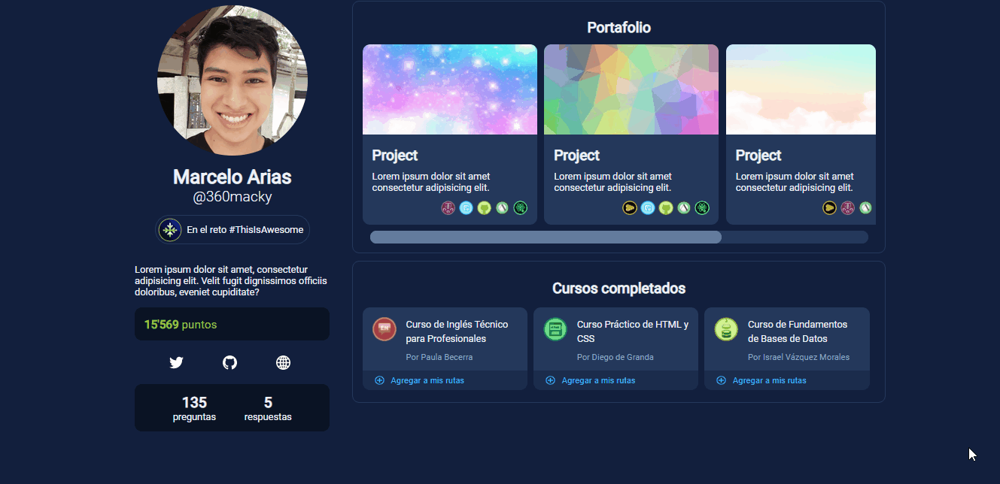
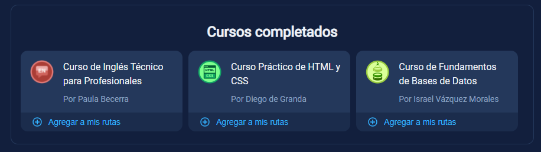
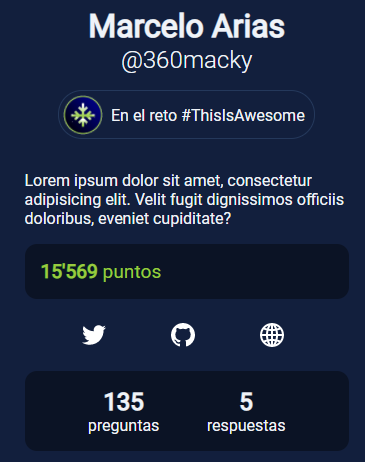
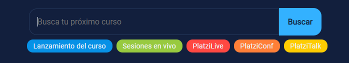

  
  <h1 align="center">Platzi UI proposals/enhancements</h1>

    💚 Improvements and proposals for the new Platzi UI. Documented and explained. 📖

## 🎈 Context

I see in the last year that Platzi is changing its design. Looks cooler! And like any platform, this is taking place progressively. So far, the home, classes, courses and exams have this new design.

So I decided to propose and then develop UIs for the following pages: Profile, Jobs (Platzi Connect), and Agenda/Calendar.

## ⛄ Platzi Profile

The profile page has a primary section for description, social media links, points, questions and answers, then two secondary sections **My courses** and **My portfolio**.

I considered that it would be better if the portfolio and courses were both visible. The portfolio, with greater relevance, since it's a reflection of the work of the students.

With the new UI from the desktop screen, the portfolio and courses of the student are visible. All the information, statistics and social networks of the student go to the left.

One particular feature that I would love to add would be to highlight your favorite courses, or courses with the highest impact for the student. Then, with a "Like"/"Love" button, the courses that the student recommends are ordered at the beginning.

The **Add to my routes** button is also added within each course. I find it useful for students who have just discovered a new course.

On the left side, the information is gathered in this order: Full name, username, badge/challenge, description, points, social networks, number of questions and answers.

In the mobile version the three components: Profile, Portfolio and Courses are visible in the same order.

So far the badge is an image placed on the lower right border of the profile. Instead I included it as a kind of status of the challenge, or the program that the student is following with a meaningful text.

The links to social networks are great, I like the idea of having a choice to place social networks that the student may find useful to highlight: Twitter, GitHub, Medium, Behance, Dribbble, etc. Including the student's personal website.

But there is also another idea about adding several links to social networks. I stuck with the first idea, highlighting Twitter (personal brand), GitHub (variable, in this case as a developer), and Web (website).

## 🔮 Platzi Connect

By far I really love the idea of Platzi Connect.

It's interesting, because it has three sections: Community projects, job offers, find talent.

So I asked myself how to unite the three functions. Like Google Fonts and its well-designed search engine.

A search engine integrated in Platzi Connect would have as actionable these three points with examples:

- Community projects: Amazing application using `React`.
- Job offers: We are looking for a `React` developer.
- Talent: Joseph is a `React` developer.

`React` would be the search term that a student and/or recruiter would use within **Platzi Connect**.

At the moment I only have the projects option covered. I add the option to save projects to review later.

## 📅 Platzi Agenda

In this case I think the main visible component of the page is the next (or soon) 9 events. And a search engine that shows events in real time.

The labels for the 5 categories (Course launching, Live sessions, PlatziLive, PlatziConf and PlatziTalk) that I originally found on Platzi Agenda are also added. With the original colors, but without transparency.

The **add to Google Calendar** function is useful, but I would like to propose a replacement like **"Notify me premiere"**, this would immediately trigger an email to the student with the date (from here it can also be automatically added to Google Calendar), and with another future email notification when the course is available.

The Twitter share button is also available at the top right of the event card.
